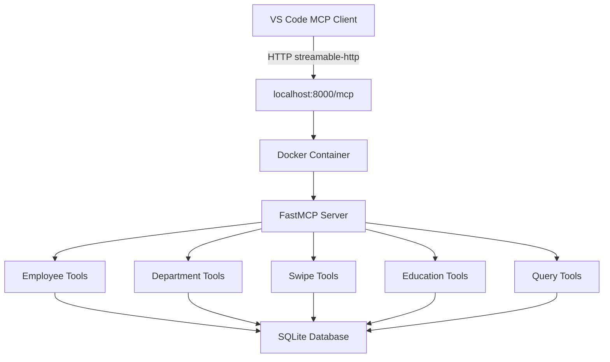
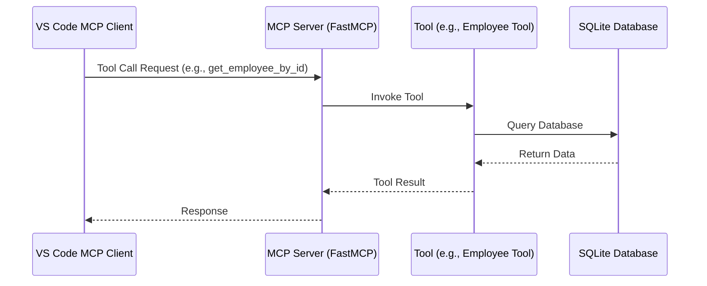

# mcp-server-demo

## Overview

This project demonstrates a Model Context Protocol (MCP) server for an HR database using FastMCP. The server provides tools for managing employee data, departments, attendance swipes, education records, and custom SQL queries. It runs in a Docker container and communicates with VS Code via the streamable-http transport.

### Features

- **Employee Management**: Tools for getting, adding, updating, and deleting employee records
- **Department Management**: Tools for managing department information and summaries
- **Attendance Tracking**: Tools for recording and querying employee swipes
- **Education Records**: Tools for managing employee education details
- **Custom Queries**: Read-only SQL query execution against the database
- **Dockerized**: Easy deployment and isolation using Docker containers

### Architecture



#### Sequence Diagram



## Installation

1. Clone the repository:
   ```bash
   git clone https://github.com/thavaselvan/mcp-server-demo.git
   cd mcp-server-demo
   ```

2. Install dependencies:
   ```bash
   pip install -r requirements.txt
   ```

3. Build the Docker image:
   ```bash
   docker build -t hr-database-mcp:latest .
   ```

## Usage

### Running in Docker

1. Run the container:
   ```bash
   docker run --rm -p 8000:8000 -v "$(pwd)/employees.db:/app/employees.db" --name hr-database-mcp hr-database-mcp:latest
   ```

2. Configure VS Code MCP client in `.vscode/mcp.json`:
   ```json
   {
     "servers": {
       "hr-database": {
         "url": "http://localhost:8000/mcp",
         "transport": "streamable-http"
       }
     }
   }
   ```

## Database

The application uses SQLite (`employees.db`) for data storage. The database schema includes tables for employees, departments, swipes, and education records.

## Tools

- `get_all_employees`: Get all employees from the database
- `get_employee_by_id`: Get employee information by ID
- `get_employees_by_department`: Get all employees in a specific department
- `get_department_summary`: Get a summary of employees by department
- `get_all_departments`: Get all departments from the database
- `get_department_by_id`: Get department information by ID
- `get_employee_swipes`: Get all swipe in/out records for a specific employee
- `get_attendance_summary`: Get attendance summary for a specific date
- `get_employee_education`: Get education details for a specific employee
- `run_readonly_sql`: Execute readonly SQL queries against the employee database (read-only SELECT queries only)
